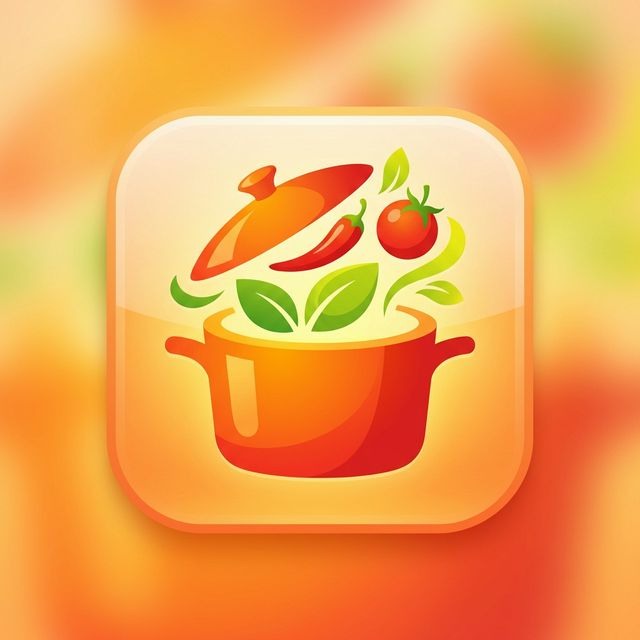

<a id="readme-top"></a>

<br />
<div align="center">
  <a href="https://clipcookbook.famretera.nl">
    
  </a>

  <h3 align="center">ClipCookBook</h3>

  <p align="center">
    A self-hosted web application to extract, save, and organize recipes from social media using AI.<br />
    Turn Instagram Reels, TikToks, and other social media posts into structured cooking instructions instantly.
    <br /><br />
    <a href="https://github.com/minemap-nl/ClipCookBook/issues/new?labels=bug&template=bug-report---.md">Report Bug</a>
    &middot;
    <a href="https://github.com/minemap-nl/ClipCookBook/issues/new?labels=enhancement&template=feature-request---.md">Request Feature</a>
  </p>
</div>

---

<details>
<summary><strong>Table of Contents</strong></summary>
<ol>
  <li>
    <a href="#about-the-project">About The Project</a>
    <ul>
      <li><a href="#built-with">Built With</a></li>
    </ul>
  </li>
  <li><a href="#key-features">Key Features</a></li>
  <li>
    <a href="#getting-started">Getting Started</a>
    <ul>
      <li><a href="#prerequisites">Prerequisites</a></li>
      <li><a href="#installation-docker">Installation (Docker)</a></li>
    </ul>
  </li>
  <li><a href="#ai-integration">AI Integration</a></li>
  <li><a href="#license">License</a></li>
  <li><a href="#contact">Contact</a></li>
</ol>
</details>

---

## About The Project

**ClipCookBook** is your personal, self-hosted database for all those delicious recipes you find while scrolling through social media. Instead of saving a post and never looking at it again, ClipCookBook uses AI (like Google Gemini) to extract ingredients, portions, and step-by-step instructions directly from the post URL.

It's designed to be fast, private, and fully under your control.

### Built With

* [Next.js][next-url]
* [React][react-url]
* [TypeScript][typescript-url]
* [Prisma][prisma-url] (SQLite)
* [Google Gemini AI][gemini-url]
* [Docker][docker-url]

<p align="right">(<a href="#readme-top">back to top</a>)</p>

---

## Key Features

* **📱 Social Media Extraction** — Paste an Instagram or TikTok link and let AI do the work.
* **🤖 AI-Powered** — Automatically identifies ingredients, amounts, units, and cooking steps.
* **🎥 Media Gallery** — Keeps the original video and thumbnails alongside the recipe.
* **📅 Automated Backups** — Optional automatic backups to keep your data safe.
* **📧 Email Integration** — Built-in support for sending recipes via SMTP.
* **🔒 Self-Hosted** — You own your data. Simple SQLite database with easy Docker deployment.

<p align="right">(<a href="#readme-top">back to top</a>)</p>

---

## Getting Started

The recommended way to install **ClipCookBook** is via **Docker**.

### Prerequisites

* **Docker** and **Docker Compose** installed on your server.
* *(Optional)* A Google Gemini API Key (Free tier is supported!).

### Installation (Docker)

1. Create a directory for the project and navigate into it.
2. Create a file named `docker-compose.yml`.
3. Paste the following configuration:

```yaml
services:
  clipcookbook:
    image: ghcr.io/minemap-nl/ClipCookBook:latest
    container_name: ClipCookBook
    restart: always
    stop_grace_period: 5s
    ports:
      - "9416:3000"
    volumes:
      - ./db:/app/data
      - ./thumbnails:/app/public/thumbnails
      - ./videos:/app/public/videos
      - ./backups:/app/backups
    environment:
      - DATABASE_URL=file:/app/data/dev.db
      - NEXT_PUBLIC_LANGUAGE=en # UI Language ('en' or 'nl')
      - PROCESS_METHOD=ai # Set to 'manual' to disable AI features
      - GEMINI_API_KEY=your-gemini-api-key
      - APP_NAME=ClipCookBook
      - APP_URL=https://clipcookbook.yourdomain.com #or whatever http or https domain you want. You can also just use http://{your internal ip-adres}:{port number in this case 9416}
      - SITE_PASSWORD=your-secret-password
      - JWT_SECRET=your-random-jwt-secret
      - AUTO_BACKUP=true
      - LANGUAGE=en
```

4. Start the stack:

```sh
docker compose up -d
```

<p align="right">(<a href="#readme-top">back to top</a>)</p>

---

## AI Integration

ClipCookBook currently leverages **Google Gemini AI** to transform unstructured social media data into structured recipes.

* **Free Tier Supported**: You can use a free tier API key from [Google AI Studio](https://aistudio.google.com/).
* **Optimal Results**: AI is required for optimal automatic extraction of ingredients and steps. Without it (`PROCESS_METHOD=manual`), you can still save links and media but an algoritm will try to do it's best using the description of a social media video. You also can't use the photo recipe extraction feature. You can always enter recipe details manually.
* **Future Updates**: Support for additional AI providers (like OpenAI or local LLMs) is planned for future releases.

<p align="right">(<a href="#readme-top">back to top</a>)</p>

---

## License

**Source Available – MIT with Commons Clause**

This project is licensed under the **MIT License** with the **Commons Clause** condition.

* ✅ You may use, copy, modify, and distribute this software for personal or internal business use.
* ✅ You may use this software to share files with clients or partners as part of normal business operations.
* ❌ You may **not** sell this software or offer it as a commercial SaaS product where the primary value comes from the software itself.

See the `LICENSE` file for details.

<p align="right">(<a href="#readme-top">back to top</a>)</p>

---

## Contact

**Minemap / Famretera**  
Website: [https://clipcookbook.famretera.nl](https://clipcookbook.famretera.nl)

Project Repository: [https://github.com/minemap-nl/ClipCookBook](https://github.com/minemap-nl/ClipCookBook)

<p align="right">(<a href="#readme-top">back to top</a>)</p>

---

[next-url]: https://nextjs.org/
[react-url]: https://reactjs.org/
[typescript-url]: https://www.typescriptlang.org/
[prisma-url]: https://www.prisma.io/
[gemini-url]: https://aistudio.google.com/
[docker-url]: https://www.docker.com/
